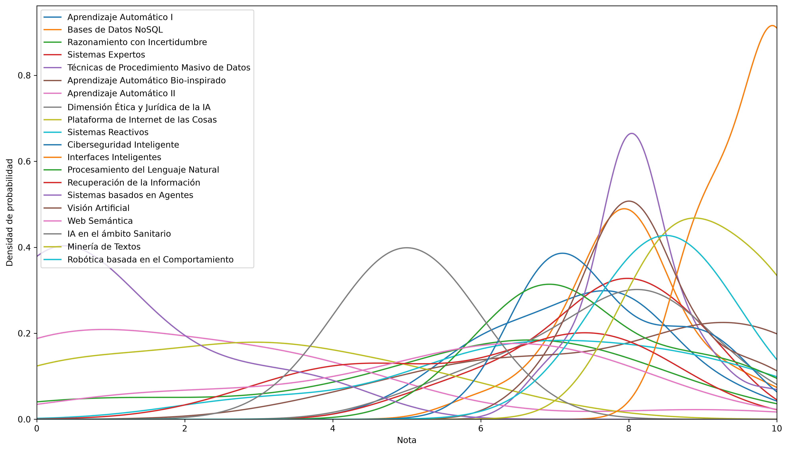
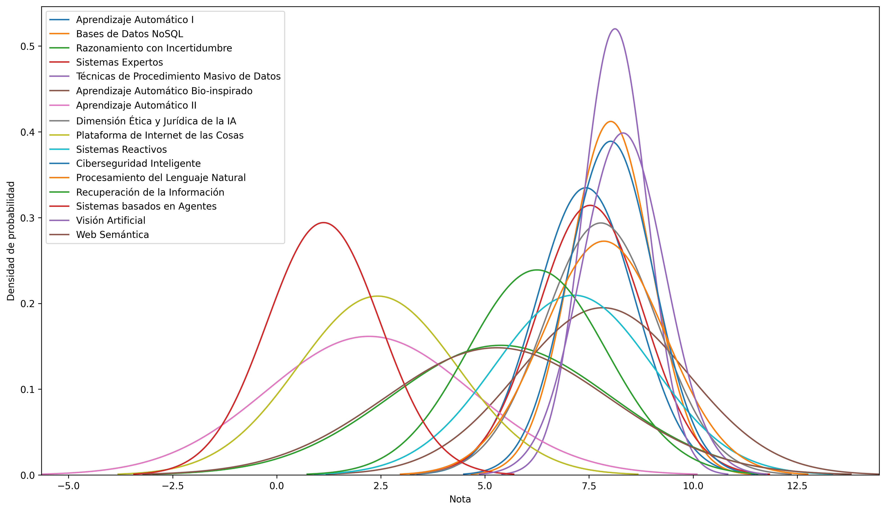

# Asignaturas optativas del Grado en Inteligencia Artificial 2025

Este es un repositorio que calcula distintos métodos de votación y métricas para comparar las distintas asignaturas optativas del Grado en Inteligencia Artificial de la [Universidad de Vigo](https://www.uvigo.gal/). Los datos han sido obtenidos con este [cuestionario](https://docs.google.com/forms/d/e/1FAIpQLSeHNeIP01vFKP7Y-J_DAL-7Cn0_YEE-8jA3jm2dRxvhtSVvgA/viewform?usp=dialog) que envía su información a esta [hoja de cálculo](https://docs.google.com/spreadsheets/d/1WvO5IBgJ3F6b6zHFQD5eWSxN-IUe3ONEvazHEUGb3Qo).

## Resumen estadístico

Estas son distintas métricas para todas las asignaturas, ordenadas por su media.

|  
Asignatura  |  
Media  |  
Desviación típica  |  
Mediana  |  
Moda  |  
Máximo  |  
Mínimo  |  
Número de alumnos |
|:--|:--:|:--:|:--:|:--:|:--:|:--:|--:|
| Visión Artificial  | 8.32  | 1  | 8  | 8  | 9.9  | 7  | 6 |
| Técnicas de Procedimiento Masivo de Datos  | 8.12  | 0.77  | 8  | 8  | 10  | 7  | 13 |
| Ciberseguridad Inteligente  | 8.02  | 1.03  | 8  | 7  | 9.1  | 7  | 5 |
| Bases de Datos NoSQL  | 8.02  | 0.97  | 8  | 8  | 10  | 6  | 14 |
| Procesamiento del Lenguaje Natural  | 7.86  | 1.46  | 7  | 7  | 10  | 6  | 7 |
| Aprendizaje Automático Bio-inspirado  | 7.83  | 2.05  | 8.5  | 10  | 10  | 4  | 14 |
| Dimensión Ética y Jurídica de la IA  | 7.78  | 1.36  | 8  | 7  | 10  | 5  | 13 |
| Sistemas Expertos  | 7.53  | 1.27  | 7.75  | 7  | 9  | 5  | 14 |
| Aprendizaje Automático I  | 7.42  | 1.19  | 7.5  | 7  | 9.6  | 5  | 15 |
| Sistemas Reactivos  | 7.13  | 1.9  | 7.15  | 6  | 10  | 3  | 14 |
| Recuperación de la Información  | 6.25  | 1.67  | 7  | 7  | 8  | 4  | 8 |
| Razonamiento con Incertidumbre  | 5.38  | 2.64  | 6  | 7  | 9  | 0  | 15 |
| Web Semántica  | 5.29  | 2.69  | 6  | 6  | 8  | 1  | 7 |
| Plataforma de Internet de las Cosas  | 2.42  | 1.91  | 3  | 0  | 5  | 0  | 13 |
| Aprendizaje Automático II  | 2.22  | 2.47  | 2  | 0  | 9  | 0  | 15 |
| Sistemas basados en Agentes  | 1.12  | 1.36  | 1  | 0  | 4  | 0  | 8 |
| Interfaces Inteligentes  | nan  | nan  | nan  | nan  | nan  | nan  | 0 |

## Distribuciones de probabilidad

Estas son las distribuciones de probabilidad de las notas para cada asignatura, normalizadas entre 0 y 10.

## [Distribuciones normales](https://en.wikipedia.org/wiki/Normal_distribution)

Estas son las distribuciones normales usando la media y desviación típica de cada asignatura.

## [Método Schulze](https://en.wikipedia.org/wiki/Schulze_method)

Para el método Schulze se necesita un ranking de cada votante para todas las opciones. Como en este caso tenemos una nota numérica, se pone que un votante prefiere una asignatura sobre otra si le ha dado una nota mayor. Esto se divide por el número de alumnos que han votado a las dos asignaturas para normalizar.

|  
Asignatura |
|:--:|
| Bases de Datos NoSQL |
| Técnicas de Procedimiento Masivo de Datos |
| Aprendizaje Automático Bio-inspirado |
| Visión Artificial |
| Ciberseguridad Inteligente |
| Dimensión Ética y Jurídica de la IA |
| Procesamiento del Lenguaje Natural |
| Sistemas Expertos |
| Aprendizaje Automático I |
| Sistemas Reactivos |
| Recuperación de la Información |
| Razonamiento con Incertidumbre |
| Web Semántica |
| Plataforma de Internet de las Cosas |
| Aprendizaje Automático II |
| Sistemas basados en Agentes |
| Interfaces Inteligentes |
